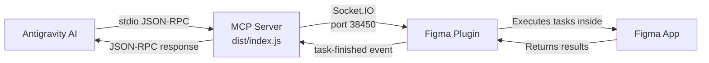

# Figma MCP Server — Complete Troubleshooting Guide

> **Server**: [Antonytm/figma-mcp-server](https://github.com/Antonytm/figma-mcp-server)  
> **Location**: `C:\Users\ateli\Desktop\figma-mcp-server\mcp`  
> **Date**: June 5–6, 2026  
> **Status**: ✅ FULLY RESOLVED — Both Figma Plugin & Antigravity connected

---

## Architecture Overview

This MCP server has a **dual-connection architecture** that's critical to understand:



- **Antigravity** connects via `stdio` (standard input/output) — JSON-RPC protocol
- **Figma Plugin** connects via **Socket.IO WebSocket** on `http://localhost:38450`
- When Antigravity calls a tool (e.g. `get-node-info`), the server relays it to the Figma Plugin, which executes it inside Figma and sends results back
- **Both connections must be active simultaneously** for tools to work

---

## Issue #1: Node.js Version Incompatibility (`EBADENGINE`)

### Symptom
```
npm warn EBADENGINE Unsupported engine
```

### Root Cause
The MCP server required Node.js v20+, but an older version was installed.

### Fix
Upgraded to **Node.js v24.16.0** using:
```powershell
winget install OpenJS.NodeJS
```

---

## Issue #2: TypeScript Compiler Heap Crash (`FATAL ERROR: Reached heap limit`)

### Symptom
```
FATAL ERROR: Reached heap limit Allocation failed - JavaScript heap out of memory
```
Running `npm run build` or `tsc` would crash every time.

### Root Cause
Two problems combined:
1. `tsconfig.json` was **not excluding `node_modules`**, causing the compiler to parse thousands of unnecessary files
2. Default Node.js heap limit (~1.7GB) was insufficient even after the exclude fix

### Fix Applied
**Step 1** — Added exclude to [tsconfig.json](file:///C:/Users/ateli/desktop/figma-mcp-server/mcp/tsconfig.json):
```json
{
  "exclude": ["node_modules"]
}
```

**Step 2** — Updated build script in [package.json](file:///C:/Users/ateli/desktop/figma-mcp-server/mcp/package.json):
```json
"build": "node --max-old-space-size=4096 node_modules/typescript/bin/tsc"
```

### Final Resolution
Even with these fixes, `tsc` was extremely slow and unstable on this system. **Replaced with `esbuild`** (see Issue #5).

---

## Issue #3: `dotenv` / `dotenvx` Stdout Pollution

### Symptom
Antigravity reported: `calling "initialize": EOF` — the MCP handshake failed silently.

### Root Cause
The `dotenv` package (which internally uses `dotenvx`) printed a human-readable message to **stdout** on every startup:
```
◇ injected env (1) from .env // tip: ⌘ enable debugging { debug: true }
```

The MCP `stdio` protocol uses stdout **exclusively** for JSON-RPC messages. Any non-JSON text on stdout corrupts the protocol and causes an immediate disconnect.

### Fix Applied
Commented out `dotenv.config()` in [index.ts](file:///C:/Users/ateli/desktop/figma-mcp-server/mcp/src/index.ts):
```diff
-dotenv.config();
+// dotenv.config();
```

> [!IMPORTANT]
> Environment variables are now passed via `mcp_config.json`'s `env` block instead of `.env` file. This is actually cleaner since each client (Antigravity, Plugin) may need different env values.

---

## Issue #4: Socket.IO `console.log` on Stdout

### Symptom
Even after fixing dotenv, the handshake still showed non-JSON text:
```
Socket.IO server listening on http://localhost:38450
{"result":{"protocolVersion":"2025-03-26",...}}
```

### Root Cause
In [stdio.ts](file:///C:/Users/ateli/desktop/figma-mcp-server/mcp/src/stdio.ts), line 31 used `console.log()` which writes to **stdout**, corrupting the JSON-RPC stream.

### Fix Applied
Changed to `console.error()` which writes to **stderr** (invisible to MCP protocol):
```diff
-console.log(`Socket.IO server listening on http://localhost:${PORT}`);
+console.error(`Socket.IO server listening on http://localhost:${PORT}`);
```

> [!CAUTION]
> **Golden Rule for MCP stdio servers**: NEVER use `console.log()` anywhere in the codebase. Always use `console.error()` for human-readable messages. `stdout` is reserved exclusively for JSON-RPC.

---

## Issue #5: `esbuild` Dynamic Require Error

### Symptom
```
Error: Dynamic require of "http" is not supported
```

### Root Cause
First attempt at using `esbuild` bundled **everything** including Node.js built-in modules (`http`, `net`, etc.) into a single ESM file. ESM doesn't support `require()`, so bundled CommonJS dependencies like `socket.io` crashed.

### Fix Applied
Added `--packages=external` flag to keep Node.js packages as external imports:
```powershell
npx esbuild src/index.ts --bundle --platform=node --packages=external --format=esm --outdir=dist
```

This produces a small 30KB bundle that imports packages normally at runtime instead of inlining them.

---

## Issue #6: Port 38450 Already in Use (`EADDRINUSE`)

### Symptom
```
Error: listen EADDRINUSE: address already in use :::38450
```

### Root Cause
The `stdio.ts` module starts a Socket.IO HTTP server on port 38450 **even in stdio mode** (this is by design — the Figma Plugin needs to connect). When a previous server instance was left running (zombie process), the new instance couldn't bind the port.

### Fix Applied
Kill zombie processes before restarting:
```powershell
Get-NetTCPConnection -LocalPort 38450 -ErrorAction SilentlyContinue |
  Select-Object -ExpandProperty OwningProcess |
  ForEach-Object { Stop-Process -Id $_ -Force }
```

> [!WARNING]
> Every time you test the server manually (`node dist/index.js`), it occupies port 38450. You **must** kill it before Antigravity can start its own instance. Antigravity auto-starts the server when the window loads.

---

## Issue #7: `.env` File Forcing HTTP Transport

### Symptom
We created a `.env` file with `TRANSPORT=streamable-http` to connect the Figma Plugin directly. Later, when Antigravity tried `stdio` mode, the `.env` file overrode the `TRANSPORT` env var and forced HTTP mode, causing conflicts.

### Fix Applied
Deleted the `.env` file entirely:
```powershell
Remove-Item C:\Users\ateli\desktop\figma-mcp-server\mcp\.env -Force
```

Transport is now controlled exclusively via `mcp_config.json`:
```json
"env": {
  "TRANSPORT": "stdio"
}
```

---

## Final Working Configuration

### [mcp_config.json](file:///C:/Users/ateli/.gemini/config/mcp_config.json)
```json
{
  "mcpServers": {
    "figma": {
      "command": "node",
      "args": [
        "C:\\Users\\ateli\\Desktop\\figma-mcp-server\\mcp\\dist\\index.js"
      ],
      "env": {
        "FIGMA_PERSONAL_ACCESS_TOKEN": "token",
        "TRANSPORT": "stdio"
      }
    }
  }
}
```

### Build Command (use instead of `tsc`)
```powershell
npx esbuild src/index.ts --bundle --platform=node --packages=external --format=esm --outdir=dist
```

### How to Connect Figma Plugin
1. Open Figma → Plugins → Run **"MCP Server for Figma"**
2. Enter `http://localhost:38450` and click Connect
3. Plugin should show **"Connected"**

### How to Verify Antigravity Connection
After `Developer: Reload Window`, the Figma MCP tools should appear in the tool list:
- `get-pages`, `get-node-info`, `get-selection`
- `create-rectangle`, `create-frame`, `create-text`, etc.

---

## Modified Source Files

| File | Change | Why |
|------|--------|-----|
| [tsconfig.json](file:///C:/Users/ateli/desktop/figma-mcp-server/mcp/tsconfig.json) | Added `"exclude": ["node_modules"]` | Prevent heap crash |
| [package.json](file:///C:/Users/ateli/desktop/figma-mcp-server/mcp/package.json) | Added `--max-old-space-size=4096` to build | Increase heap limit |
| [index.ts](file:///C:/Users/ateli/desktop/figma-mcp-server/mcp/src/index.ts) | Commented out `dotenv.config()` | Prevent stdout pollution |
| [stdio.ts](file:///C:/Users/ateli/desktop/figma-mcp-server/mcp/src/stdio.ts) | `console.log` → `console.error` | Prevent stdout pollution |
| `.env` | **DELETED** | Prevented transport override |

---

## Quick Reference: Common Errors & Fixes

| Error | Fix |
|-------|-----|
| `EBADENGINE` | Upgrade Node.js to v20+ |
| `Reached heap limit` | Use `esbuild` instead of `tsc` |
| `calling "initialize": EOF` | Remove all `console.log` from server code, delete `.env` |
| `Dynamic require of "http"` | Add `--packages=external` to esbuild |
| `EADDRINUSE :::38450` | Kill zombie: `Get-NetTCPConnection -LocalPort 38450 \| ...` |
| Figma Plugin "No MCP connected" | Make sure server is running + Plugin points to `localhost:38450` |
| Tools not showing in Antigravity | Reload Window after saving `mcp_config.json` |
